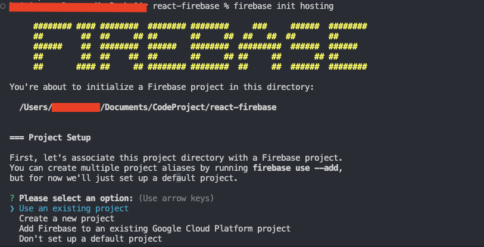
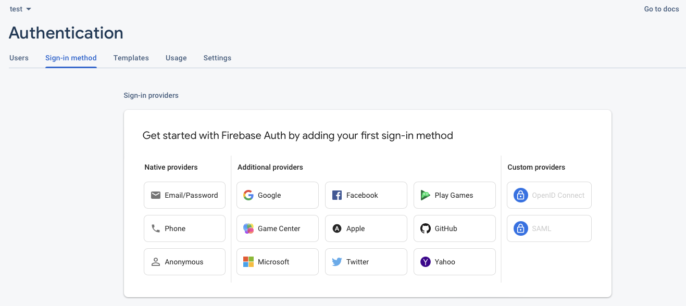
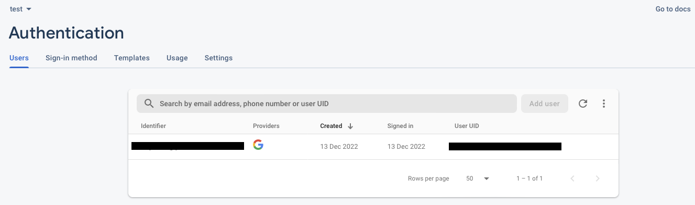
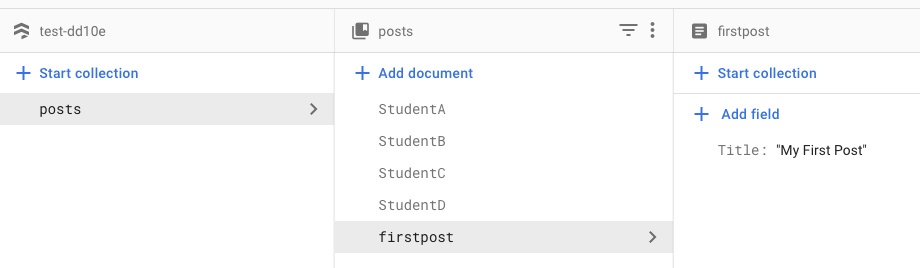
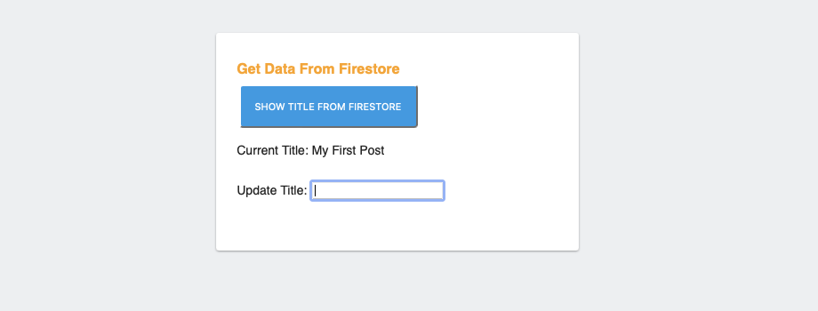
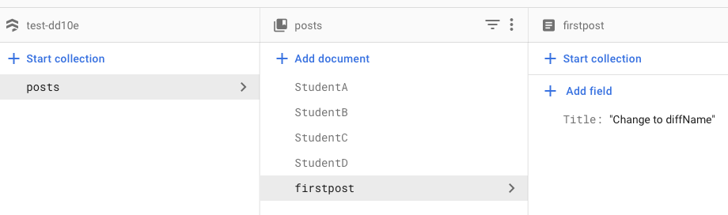
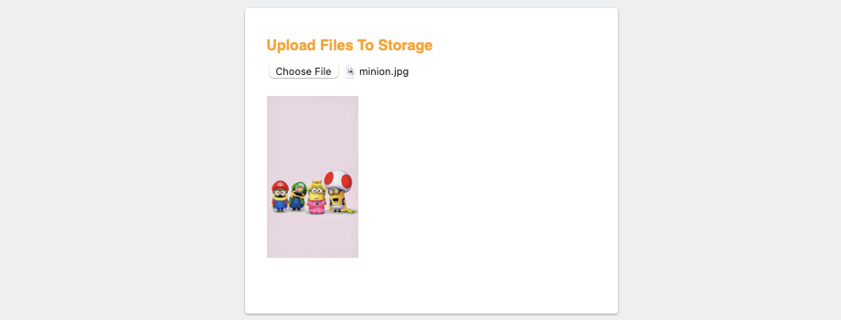
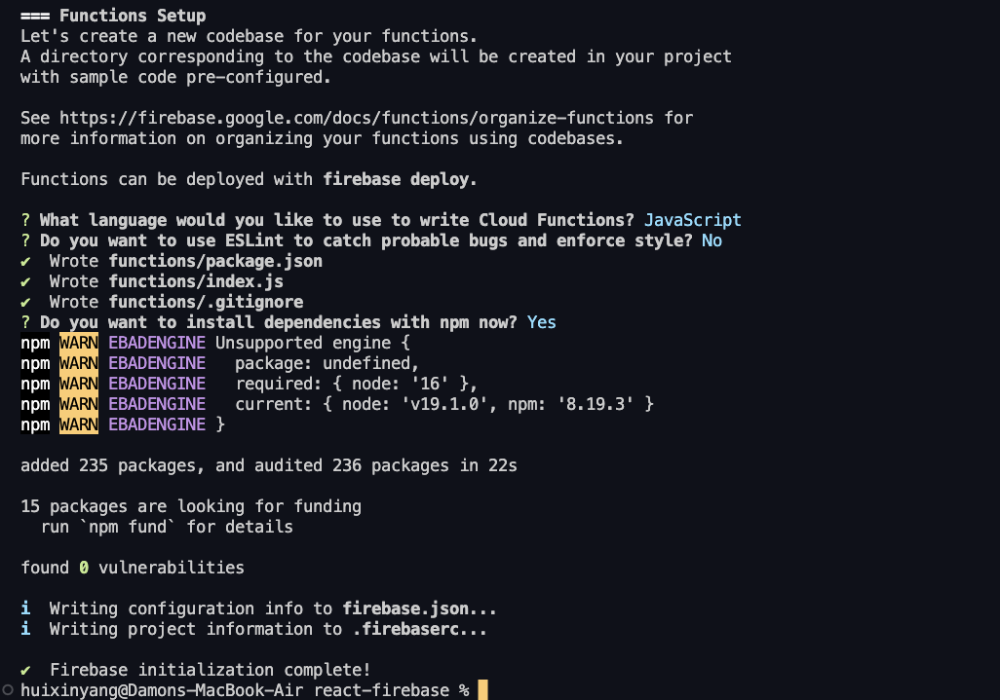

# react-firebase

## How to deploy our app
First of all, go to [firebase](https://console.firebase.google.com/u/0/), and create a project.


Install firebase command line tool so that you can deploy a project via CLI. For other CLI management options, visit the [CLI documentation](https://firebase.google.com/docs/cli#update-cli) 
```bash
$ npm install -g firebase-tools
```

Run login before hosting if you haven't login.
```bash
$ firebase login
```

If you want to start from scratch, you can use this initial templates.
```bash
$ firebase init hosting
```
That's going to create some files for us.

You are going to see this



Then, I select "Use an existing project" for this demo, and select the project I just created via the firebase console website.


The default files will be created. The public folder with index.html is our actual app which imports the firebase web SDK in the head of the document.

Now, let's spin up a web server locally by running `firebase serve`. Or
```bash
$ firebase deploy
```

This is much more powerful, which allow us view our app live on the internet instead of local host.

## Authentication - Google Login

Go to firebase console website on nav bar to find `Build > Authentication > Sign-in Method`, and hit Google to enable it.



After hitting `LOGIN WITH GOOGLE ACCOUNT`, you can see the user history via firebase console web.




## Database
We can use Firestore database or Realtime database. [Compare Database.](https://firebase.google.com/docs/database/rtdb-vs-firestore?authuser=0&hl=en)
For this demo, I use Cloud Firestore and choose test mode.

### Get the data from Firestore.




### Update the title




Filter students who are older than 5.


## Storage
The cloud storage bucket is tied to your firebase project. In this example, I  upload and download the files from and to Storage bucket.



## Functions
Anything that you can do with `node.js` you can do with ` functions.
We can initialize functions in our project, and I am going to implement with a firebase function and firestore database triggers.
```bash
$ firebase init functions
```
It will create a isolated folder named `functions` for us.



---pending: Spark Plan has no functions---